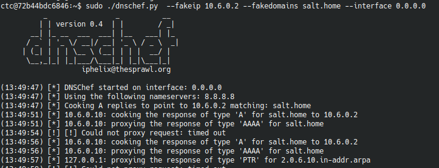

# Salty walkthrough

This challenge emulates the case the Salt master orchestrating a saltstack infrastructure is compromised and therefore all the minion which can be enrolled.
The flag will be placed in the minion home folder. 
KillChain overview: 

1. Connect over SSH to the master
2. Network packet inspection 
3. Identify the DHCP request packets
4. Configure the DHCP server in order to assign the MINION an IP and the correct Domain Name Server
5. Network packet inspection
6. Identify the DNS request by the minion
7. Setup fake DNS ( dnschef )
8. Intercept minion communication and figure out which kind of service is communicating to ( port 4506 )
9. Enroll the key sent by the minion in the master
10. Exploit the master feature to execute command to enrolled minions 

Below chapters will contain a more detailed walkthrough

## Flag KillChain 
Flag description: 'It seems some attacker were able to connect here and control all our IoT devices ...'

1. Connect via SSH to the master container. Once connected to the master via SSH the partecipant should notice a network interface on 10.6.0.0/24
    

2. Exploit the sudo privilege to run tcpdump on the interface and the partecipant should notice DHCP request package
    

3. Setup the DHCP server in order to provide a correct IP and DNS configuration to the minion in order to let it use the master as Domain Name Server

    

    Then run service isc-dhcp-server start

    
 
    Check an "OK" message is successfully printed out at least for IPv4 configuration    
 
4. Network inspect packets once again to notice the minion successfully got an IP address and it's now sending DNS queries to the master for "salt.home" ( which might be changed).

    

5. Setup a fake DNS server ( https://github.com/iphelix/dnschef ) in order to spoof the hostname with the master IP address  

    
  
     Once the DNS proxy is correctly setup tcpdump command would show the minion trying to reach the "salt.home" host on port 4506. This means the minion is trying
     to send its key in order to be enrolled in the master

    

6. Once this communication is happening it is possible to run the command salt-key -L on the master to list all the minion which are trying to be enrolled (salt-master process must be started first)
     
     
    

7. After the minion is accepted by the master, the master can run commands on the minion: 

     
